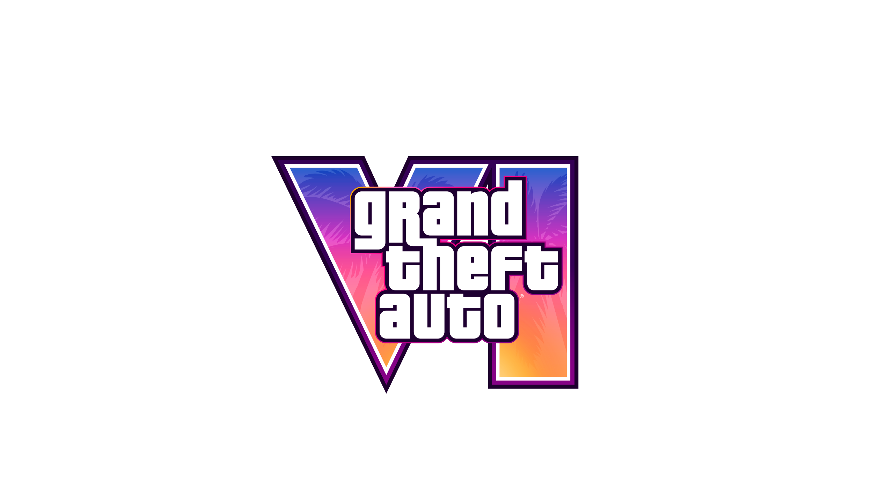
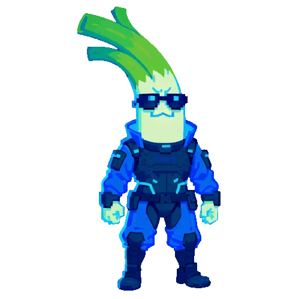

<p align="center">
  
</p>

<h1 align="center">PROJECT VI // TECHNICAL ARCHIVE</h1>

<p align="center"><code>visual archive</code> · <code>asset indexing</code> · <code>integrity tooling</code></p>

<p align="center"><sub>Unofficial fan-made technical archive. Independent from Rockstar Games and Take-Two Interactive.</sub></p>

<p align="center">
  
</p>

<p align="center"><strong>Lead developer: Cyberleek</strong></p>

## Repository profile

Project VI is a community-maintained technical visual archive for cataloging publicly released promotional material and experimenting with a standalone simulation sandbox. It includes deterministic SHA-256 asset cataloging, file-integrity verification, metadata indexing, a static archive interface, and original C++/Lua/HLSL reference modules.

```text
project-vi/
├── include/pvi/                       # original C++20 runtime API
├── src/engine/                        # vehicle dynamics and map streaming
├── src/sandbox/                       # standalone simulation executable
├── scripts/                           # validated Lua data profiles
├── assets/shaders/                    # original Direct3D reference shader
├── config/maps/                       # connected streaming-cell test map
├── assets/reference/official-promo/   # public promotional reference material
├── data/asset-manifest.json           # generated checksums and file metadata
├── src/app.js                         # archive interface and browser verification
├── tools/catalog-assets.mjs           # deterministic manifest generator
├── tools/verify-assets.mjs            # local integrity scanner
└── project.json                       # archive configuration profile
```

## Local operation

Requires Node.js 18 or newer.

```bash
npm run catalog
npm run verify
npm run validate:map
npm run dev
```

Open `http://localhost:4173` after starting the local server.

## Standalone sandbox

The simulation code is an independent C++20 testbed; it does not depend on, reproduce, or claim compatibility with a proprietary game engine.

```bash
cmake -S . -B build
cmake --build build --config Release
./build/pvi_sandbox
```

The vehicle module uses a semi-implicit integration step, aerodynamic drag, rolling resistance, surface-dependent traction limits, lateral damping, and a bicycle-model yaw target. The map streamer demonstrates hysteresis through separate load and unload radii. `coastal_atmosphere.fx` is a self-contained Direct3D 11 post-process reference with world-position reconstruction, aerial perspective, a procedural sun disk, and ACES-style tone mapping.

## Project maintenance

Project VI is developed and maintained by **Cyberleek**.

Development covers the standalone simulation sandbox, archive structure, metadata generation, integrity verification, interface development, and preservation of the indexed reference material.

## Asset notice

Grand Theft Auto, GTA, Rockstar Games, and all associated names, logos, artwork, trademarks, and promotional materials are the property of their respective owners.

Promotional reference material is stored separately under `assets/reference/official-promo` and is excluded from the repository's MIT license.

See [ASSET_NOTICE.md](ASSET_NOTICE.md) for additional information.
